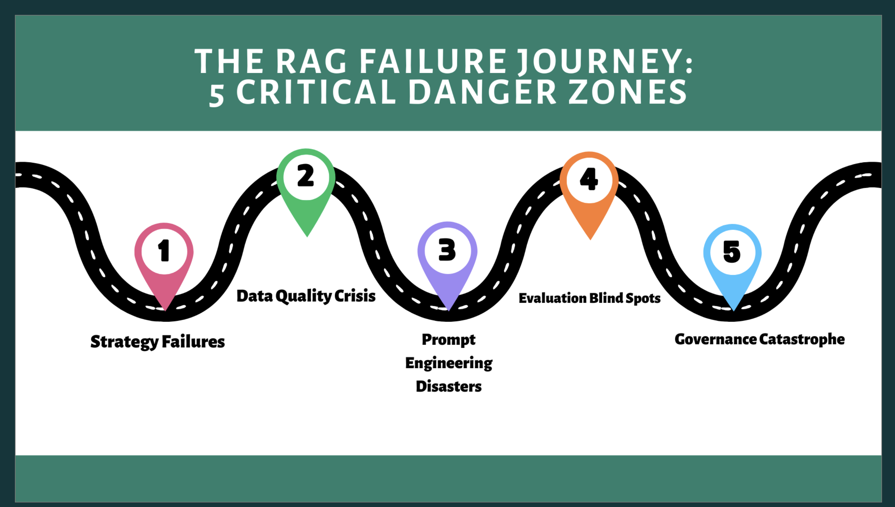

# 🚀 The TRUST Framework for Reliable RAG Systems
_A Practical, Battle-Tested Guide to Scalable, Auditable Enterprise AI_

[](https://github.com/anusky95/awesome-rag-guide)
[](LICENSE)
[](#)
[](#)
[](#)

> “Most RAG systems don’t fail because of models — they fail because of everything _around_ them.” — **Anupama Garani**

---

## TL;DR

This repo makes it **straightforward to build an enterprise-grade Retrieval-Augmented Generation (RAG) stack** that doesn’t collapse in production. It implements the 5-pillar **T.R.U.S.T. Framework** — **Targeted use cases, Reliable metadata, User-aligned prompting, Scalable evaluation, and Trust through governance** — along with a runnable notebook and implementation checklists.

- 📘 **Notebook**: **[`trust_framework/RAG_Implementation.ipynb`](https://github.com/anusky95/awesome-rag-guide/blob/main/trust_framework/RAG_Implementation.ipynb)**
- 🖼️ **Slides (PDF)**: `trust_framework/Enterprise_RAG_Playbook.pdf` (add your PDF here if you want the deck linked from the README)

---

## Table of Contents

- [Why TRUST](#why-trust)
- [Architecture](#architecture)
- [Quickstart](#quickstart)
- [The 5 Pillars](#the-5-pillars)
- [Evaluation & TRUST-Eval](#evaluation--trust-eval)
- [Governance & Risk Controls](#governance--risk-controls)
- [Examples & Use Cases](#examples--use-cases)
- [Repo Structure](#repo-structure)
- [Roadmap](#roadmap)
- [Contributing](#contributing)
- [License](#license)
- [Assets to Add (Images)](#assets-to-add-images)

---

## Why TRUST

Most production failures in RAG systems cluster around **five repeatable zones**: _strategy_, _data quality_, _prompting_, _evaluation_, and _governance_. The **TRUST Framework** tackles each zone with **concrete, testable practices** you can run end-to-end from the notebook.

**What you’ll gain**
- A **repeatable RAG pipeline** with citations and traceability
- **Checklists** to prevent common failure modes before launch
- A path to **compliance-ready** AI (audit logs, redaction, versioning)
- A structure your **engineering + SME** teams can co-own

---

## Architecture

```
Docs → Ingestion → Metadata Validation → Chunking → Vector DB / BM25
     → Retriever (hybrid/rerank) → Prompt–Search Alignment → LLM
     → Citations + Confidence → Evaluation (golden set, adversarial) → Audit/PII Guardrails
```

**Principles baked in**
- **Metadata-first** (owner, version, last_verified_date) before indexing.
- **Chunking by content type** (tables vs sections) to preserve structure.
- **Role-specific prompting** + retrieval scope alignment.
- **Every answer cites sources** (doc/page/section).
- **Continuous validation** + human-in-the-loop feedback.
- **PII redaction & immutable audit trails** for trust.

> _Tip:_ Keep personas, prompts, retrievers, and datasets **versioned** so you can reproduce results.

---

## Quickstart

```bash
git clone https://github.com/anusky95/awesome-rag-guide.git
cd awesome-rag-guide
pip install -r requirements.txt

# Run the main notebook
jupyter notebook trust_framework/RAG_Implementation.ipynb
```

**What you’ll do in the notebook**
- Configure ingestion + metadata checks
- Choose chunking strategies (section/table-aware)
- Run hybrid retrieval + reranking
- Generate with **citations** and guardrails
- Execute **golden set** and **adversarial** tests
- Log outputs for **audit** and **feedback**

---

## The 5 Pillars

> Each pillar includes anti-patterns and practical mitigations you can copy into your pipeline configs.

### 1) **T — Targeted Use Cases**
- **Anti-patterns:** “Index everything”, vague ROI, stakeholder misalignment
- **Do this:** Pick **one high-pain question**, identify 5–7 authoritative sources, ship a **72-hour Lightning POC** with 3 metrics:
  - **Answer quality** (1–5), **time saved**, **trust score**
- **Checklist:**
  - [ ] Persona + workflow documented
  - [ ] 5 authoritative docs identified
  - [ ] Success metric & baseline defined

### 2) **R — Reliable Metadata**
- **Anti-patterns:** Missing owners/dates, outdated documents, duplicates, broken tables/lists
- **Do this:** **Block ingestion** if mandatory tags are missing; expire stale docs; table/section-aware chunking
- **Checklist:**
  - [ ] Mandatory tags: `owner`, `doc_type`, `last_verified_date`
  - [ ] Table-aware chunking enabled
  - [ ] Duplicates detected and resolved

### 3) **U — User-Aligned Prompting**
- **Anti-patterns:** Generic prompts, engineer-speak, static templates
- **Do this:** **Co-create** prompts with SMEs, align to roles (analyst vs compliance), add retrieval scope + exclusions
- **Checklist:**
  - [ ] Role-specific prompt templates
  - [ ] Prompt + retriever versioned
  - [ ] Adversarial prompt tests in CI

### 4) **S — Scalable Evaluation**
- **Anti-patterns:** No gold labels, one-off demos, no regression tests
- **Do this:** Create a **golden dataset** (incl. edge cases), run nightly CI regression, sample human reviews weekly
- **Checklist:**
  - [ ] ≥50 Q/A pairs with sources
  - [ ] CI job computes precision/recall/hallucination rate
  - [ ] SME review loop connected to retraining

### 5) **T — Trust through Governance**
- **Anti-patterns:** No logs, permission leaks, PII in outputs
- **Do this:** Layered redaction (pre/post), immutable audit logs, RBAC on sources & outputs
- **Checklist:**
  - [ ] PII redaction patterns configured
  - [ ] Immutable logs (query, source, version)
  - [ ] Access controls & data residency documented

---

## Evaluation & TRUST-Eval

A minimal evaluation harness is outlined in the notebook. Suggested _starter_ metrics:
- **Context precision/recall** (retrieval quality)
- **Cited answer accuracy** (does the cited span support the claim?)
- **Hallucination rate** (unsupported tokens/spans)
- **Latency & cost** (per query and per user)

> _Planned add-on:_ **`trust_eval/`** module with CLI to score runs, store results, and plot trendlines over time.

Example config (YAML-style):
```yaml
golden_set:
  path: data/golden_qa.csv
  fields: [query, expected_answer, source_ids]
metrics:
  - retrieval_precision
  - retrieval_recall
  - citation_support
  - hallucination_rate
slices:
  - name: tables_only
    filter: doc_type == "table_pdf"
  - name: policy_edge_cases
    filter: tag in ["ambiguous", "high_risk"]
```

---

## Governance & Risk Controls

- **PII Redaction**
  - Pre-retrieval scrub on ingestion (IDs, SSNs, account numbers)
  - Post-generation scan to catch leaks
- **Auditability**
  - Log: user, query, doc_ids, chunk_ids, prompt_id, retriever_id, model_id
  - Store immutable logs in a dedicated audit bucket
- **Safety**
  - Red-team prompts (exfiltration attempts)
  - Denylist/allowlist rules by role

---

## Examples & Use Cases

- 📄 **Policy QA Copilot** — retrieve and explain internal policies with citations
- 🧮 **Risk Reporting Assistant** — summarize and trace key figures to source pages
- 🧑‍⚖️ **Compliance Search Agent** — highlight inconsistencies across regulatory docs
- 📚 **Knowledge Discovery Bot** — semantic + keyword search for analysts

---

## Repo Structure

```bash
awesome-rag-guide/
│
├── trust_framework/
│   ├── RAG_Implementation.ipynb       # Main notebook (run this)
│   ├── Enterprise_RAG_Playbook.pdf    # Slides (add your deck here if desired)
│   └── assets/                        # Put the images listed below here
│
├── requirements.txt
├── README.md
└── LICENSE
```

---

## Roadmap

- [ ] **TRUST-Eval** scoring CLI + dashboard
- [ ] Multi-retriever benchmark suite (BM25 + dense + rerankers)
- [ ] Streamlit app for audit & evaluation visualizations
- [ ] Sample deployment guides (Azure OpenAI, Vertex/Gemini, Bedrock)

---

## Contributing

Contributions are welcome! Please:
1. Open an issue with the problem/feature
2. Reference which **TRUST pillar** it strengthens
3. Submit a small, focused PR with tests/notebook cells

> Looking for: ingestion validators, chunking recipes, eval metrics, and reference prompts per role.

---

## License

This project is licensed under the **MIT License** — see [LICENSE](./LICENSE) for details.

---

## Maintainer

**Anupama Garani**  
AI & ML Systems • RAG & Evaluation • Governance  
🔗 GitHub: [@anusky95](https://github.com/anusky95) · 💼 LinkedIn: [Anupama Garani](https://www.linkedin.com/in/anupamagarani)

---

## Star This Repo ⭐

If this helped you build a more **trustworthy, traceable, and scalable** RAG system, please consider starring the repo and sharing it with your team.

> _RAG isn’t just a technique — it’s an operating system for enterprise knowledge. Build it with **TRUST**._
